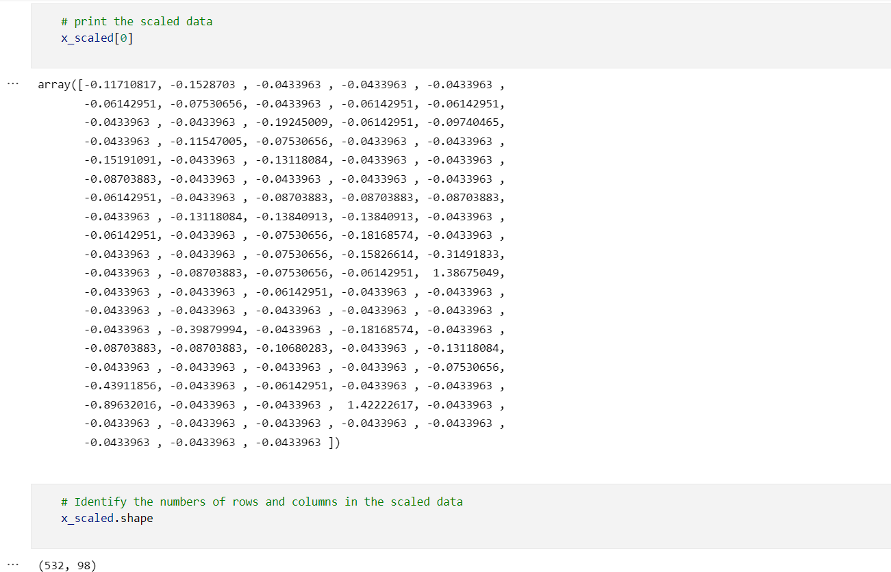

# Unsupervised-Learning for Cryptocurrency Clusters

Background

One of a financial consultancy clients, a prominent investment bank, is interested in offering a new cryptocurrency investment portfolio for its customers. The company, however, is lost in the vast universe of cryptocurrencies. They’ve asked to create a report that includes what cryptocurrencies are on the trading market and determine whether they can be grouped to create a classification system for this new investment.

With handed raw data, I first need to process it to fit the machine learning models. Since there is no known classification system, I need to use unsupervised learning. I use several clustering algorithms to explore whether the cryptocurrencies can be grouped together with other similar cryptocurrencies. I use data visualization to share my findings with the investment bank.

-Data Preparation

Read crypto_data.csv into Pandas. The dataset was obtained from CryptoCompare.

Discard all cryptocurrencies that are not being traded. In other words, filter for currencies that were currently being traded. Then drop the IsTrading column from the dataframe.

Remove all rows that have at least one null value.

Filter for cryptocurrencies that have been mined. That is, the total coins mined should be greater than zero.

In order for my dataset to be comprehensible to a machine learning algorithm, its data should be numeric. Since the coin names do not contribute to the analysis of the data, delete the CoinName from the original dataframe.

The next step in data preparation is to convert the remaining features with text values, Algorithm and ProofType, into numerical data. To accomplish this task, use Pandas to create dummy variables. Examine the number of rows and columns of my dataset now. How did they change?

Standardize my dataset so that columns that contain larger values do not unduly influence the outcome.

-Dimensionality Reduction

Creating dummy variables above dramatically increased the number of features in my dataset. Perform dimensionality reduction with PCA. Rather than specify the number of principal components when I instantiate the PCA model, it is possible to state the desired explained variance. For example, say that a dataset has 100 features. Using PCA(n_components=0.99) creates a model that will preserve approximately 99% of the explained variance, whether that means reducing the dataset to 80 principal components or 3. For this project, preserve 90% of the explained variance in dimensionality reduction. How did the number of the features change?

Next, further reduce the dataset dimensions with t-SNE and visually inspect the results. In order to accomplish this task, run t-SNE on the principal components: the output of the PCA transformation. Then create a scatter plot of the t-SNE output. Observe whether there are distinct clusters or not.

-Cluster Analysis with k-Means

Create an elbow plot to identify the best number of clusters. Use a for-loop to determine the inertia for each k between 1 through 10. Determine, if possible, where the elbow of the plot is, and at which value of k it appears.

There are some screenshots of my work:

